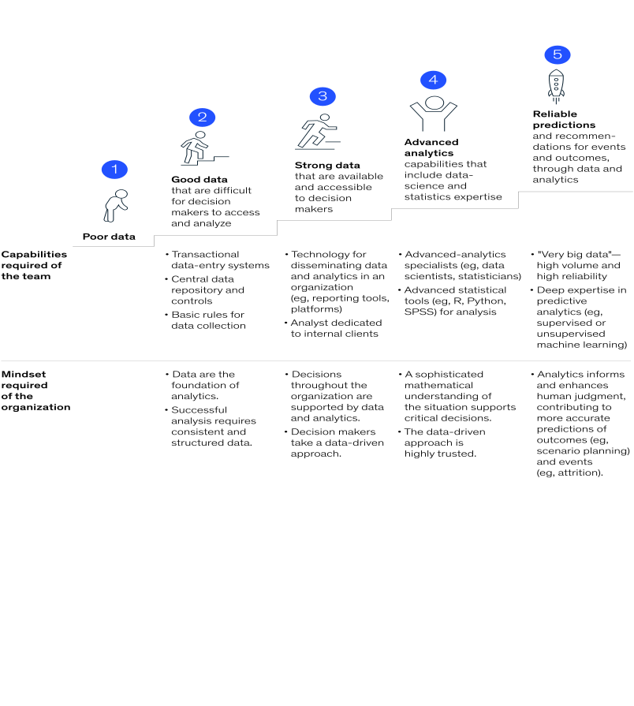

```{r setup, include=FALSE}
options(htmltools.dir.version = FALSE)
knitr::opts_chunk$set(warning = FALSE, message = FALSE)
library(kableExtra)
```

class: left, middle, r-logo

## Note on source

This document is a summary learning developed for the DFW People Analytics Meetup on 19 February 2021.  It is based on material in the open source book *[Handbook of Regression Modeling in People Analytics](http://peopleanalytics-regression-book.org)* and other named sources. Please consult this book for a deeper understanding/treatment. 

The code for this document is [here](https://github.com/keithmcnulty/peopleanalytics-regression-book/tree/master/presentations/dfw_meetup.Rmd).

## Note on languages

This document is coded in R.  Where available, alternative code in Python for some of the methods is available in the appendix.  Some of the model types used in this document are not currently well supported in Python.

---
class: left, middle, r-logo

## Skills in regression are key to operating at higher levels of the people analytics maturity staircase

```{r, echo = FALSE, fig.align= "center", out.width = "80%"}

```

.footnote[<i>Source: How To Be Great At People Analytics</i>, <a href = "https://www.mckinsey.com/business-functions/organization/our-insights/how-to-be-great-at-people-analytics">mckinsey.com</a>, October 2020]
---
class: left, middle, r-logo

## Inferential vs Predictive Modeling

* An *inferential model* is a model which is primarily concerned with *describing* a relationship between a set of input variables and an outcome variable.  It is particularly useful for answering questions related to *why* something is happening.
* A *predictive model* is primarily concerned with accurately predicting *if* an event will occur.  Often these can be complex in nature and not particularly suited to answering 'why?'.  
* Regression models can act as both inferential models and as predictive models.  
* Most commonly, questions in people analytics are primarily concerned with why something is happening.

---
class: left, middle, r-logo

## Fun exercise - the first ever model to be called a 'regression model'

Circa 1900, Francis Galton did a study on some British children to see how their heights related to that of their parents.  Let's grab Galton's data.

```{r}
# get data from URL
url <- "https://raw.githubusercontent.com/keithmcnulty/peopleanalytics-regression-book/master/data/Galton.txt"
galton <- read.delim(url)

# view first few rows
head(galton)
```

---
class: left, middle, r-logo

## What is the relationship between mid-parent height and child height

Galton simplistically expected the child's height to be perfectly explained by the average height of their parents.  We can test that using a simple linear regression model.

```{r}
library(dplyr)

# create midParentHeight column
galton <- galton %>% 
  dplyr::mutate(midParentHeight = (Father + Mother)/2)

# simple linear regression of child vs mid-parent height
simplemodel <- lm(formula = Height ~ midParentHeight, data = galton)

# how much does it explain (R-squared)
summary(simplemodel)$r.squared
```

---
class: left, middle, r-logo

## Galton realized that children 'regress' away from their parents height towards a mean population height


```{r, echo = FALSE, fig.align="center"}
library(ggplot2)

ggplot(galton, aes(x = midParentHeight, y = Height)) +
  geom_point(color = "blue") +
  geom_jitter(color = "blue") +
  geom_function(fun = function(x) {y = x}) +
  geom_function(fun = function(x) {y = mean(galton$Height)}, linetype = "dotdash") +
  geom_smooth(method='lm', formula = y~x, se = FALSE, color = "red", linetype = "dashed") +
  xlab("Mid-Parent Height (inches)") +
  ylab("Child Height (inches)") +
  theme_minimal()
```

---
class: left, middle, r-logo

## Today, we would do a multiple regression


```{r}
multimodel <- lm(formula = Height ~ Father + Mother + Gender, 
                 data = galton)
summary(multimodel)
```

---
class: left, middle, r-logo

## This model explains a lot about the *why* of a child's height


* We can see which variables are significant explainers of a child's height - all of them are!
* We can see the relative influence of each variable on a child's height - each *coefficient* tells us how many inches of height you gain for every extra unit of input, assuming all other inputs are the same.  For example:  a male child will gain over 5 inches over a female child of the same parents. For two children of the same gender and mother height, the height difference will be about 40% of the height difference of their fathers. 
* We can see how much of the overall variation in child height is explained by these three variables:  $R^2 = 0.64$.

---
class: left, middle, r-logo

## We now have many different regression methods available

```{r, echo = FALSE}
optionsdf <- data.frame(
  Outcome = c("Continuous", "Binary", "Nominal Category", "Ordered Category", 
              "Explicit grouping in data", "Latent grouping in data",
              "Time-associated events"),
  Example = c("Compensation in $", "Promoted or Not", "Choice of Health Cover Product", 
              "Performance Rating", "Individuals in sales teams",
              "Large survey instruments", "Attrition"),
  Approach = c("Linear Regression", "Binomial Logistic Regression",
               "Multinomial Logistic Regression", "Proportional Odds Regression",
               "Mixed/Multilevel Models", "Sturctural Equation Models",
               "Survival Analysis/Cox Proportional Hazard Regression")
)

kbl(optionsdf) %>%
  kable_paper(full_width = F) %>%
  column_spec(1, bold = T, border_right = T) %>%
  column_spec(2, width = "30em") %>% 
  column_spec(3, width = "30em") %>% 
  row_spec(4, background = "yellow")

```

---
class: left, middle, r-logo

## Example data set:  salespeople performance ratings

Let's look at some data that relates to the performance ratings of sales people in an organization on a scale of 1 to 3 of increasing performance:

```{r}
# load peopleanalyticsdata package
library(peopleanalyticsdata)

# look at first rows of the employee_performance data set
head(employee_performance)
```

Sales is in $m.  We are being asked which of the other four factors influence the performance rating and how do they influence it.

---
class: left, middle, r-logo

## What does our data look like?

The first data step in any modeling process is to make sure your data is in good shape.

```{r}
## look at the data types - are they appropriate?
str(employee_performance)
```

---
class: left, middle, r-logo

## Adjusting data types for appropriate modeling

We need to make sure that `region` and `gender` is understood as an **unordered** categorical column of data.  We also need to make sure that the `rating` column is understood as an **ordered** categorical column.

```{r}
## unordered categories
cat_columns <- c("region", "gender")
employee_performance[cat_columns] <- 
  lapply(employee_performance[cat_columns], 
         as.factor)

## ordered categories
employee_performance$rating <- 
  ordered(employee_performance$rating,
          levels = 1:3)

str(employee_performance)
```

---
class: left, middle, r-logo

## Quick visualizations of bivariate relationships in the data

```{r, fig.height=6, fig.align = "center"}
library(GGally)

## create a pairplot
GGally::ggpairs(employee_performance)
```

---
class: left, middle, r-logo

## We want to answer a few questions as precisely as we can

1.  Which variables are meaningful in explaining employee performance? 
2.  To what extent does each meaningful variable influence performance?
3.  How much of the entire variance of performance do these variables explain?

---
class: left, middle, r-logo

## First we need to select the right type of model

Through asking some questions about the data that we have, we can determine an appropriate model to use.

**Question 1:** What type of outcome are we studying?  *Ordered categories* 

**Question 2:** Can we assume that each input acts similarly on each level of the outcome?  *Yes for now and we can check this later.  This is called the proportional odds assumption*.

Then we should use a proportional odds logistic regression model. This model will tell us how each input variable affects the *odds of someone having a higher performance rating*.

See [Section 7.1](http://peopleanalytics-regression-book.org/ord-reg.html#when-to-use-it-2) for more details.
---
class: left, middle, r-logo

## Run the model

We can use the `polr()` function from the `MASS` package to run the model.

```{r}
library(MASS)

# formula for the model
our_formula = "rating ~ ."

# run model
model <- polr(data = employee_performance,
              formula = our_formula)
```

Now we have model sitting ready to be viewed.

---
class: left, middle, r-logo

## Viewing and clarifying the results

I like to use the `broom` package to view model results in a tidy way and to easily add columns to the results.

```{r}
library(dplyr)
library(broom)

(model_results <- tidy(model) %>% 
    filter(coef.type == "coefficient"))
```
See [Section 10.1.1](http://peopleanalytics-regression-book.org/alt-approaches.html#the-broom-package) for more information on tidy output and `broom`.

---
class: left, middle, r-logo

## Are variables significant in explaining performance?

To determine this we need to convert our `statistic` into a p-value, and determine if the p-value is less than an alpha which is usually 0.05. See [Section 3.3](http://peopleanalytics-regression-book.org/found-stats.html#hyp-tests).

```{r}
## add p-value
(model_results <- model_results %>% 
  dplyr::mutate(
    pval = (1 - pnorm(abs(statistic), 0, 1))*2
  ))
```

We can safely drop everything except `sales` and `new_customers`, because `region` and `gender` have no significant effect.

---
class: left, middle, r-logo

## Simplify the model

```{r}
simpler_formula <- "rating ~ sales + new_customers"

## create simpler model
simpler_model <- polr(data = employee_performance,
                     formula = simpler_formula)

## generate tidy results
(simpler_results <- tidy(simpler_model) %>% 
    filter(coef.type == "coefficient"))
```

---
class: left, middle, r-logo

## How does each variable affect performance?

We need to take exponents of the `estimate` to get an interpretable *odds ratio*.  See [Section 7.2](http://peopleanalytics-regression-book.org/ord-reg.html#modeling-ordinal-outcomes-under-the-assumption-of-proportional-odds).

```{r}
## create odds ratio column
(simpler_results <- simpler_results %>% 
   dplyr::mutate(
     odds_ratio = exp(estimate)
   ))
```
The odds ratio is the multiplier of the odds of a higher category associated with a one unit increase in the input variable **assuming all other variables are equal**.  Here's how we interpret this:

1.  For individuals with similar new customers, each additional $1m of sales is associated with ~46% increase in the odds of higher performance.
2.  For individuals with similar sales, each additional new customer is associated with ~48% increase in the odds of higher performance.

---
class: left, middle, r-logo

## How much of the overall variance in performance is explained by this model?

In a linear model we would use an $R^2$ value to get a good point of view on this.  In a logistic model there are several variants of this called *pseudo-* $R^2$.  Let's look at a few popular variants.  See [Section 5.3.2](http://peopleanalytics-regression-book.org/bin-log-reg.html#logistic-gof) for more information on these metrics.

```{r}
library(DescTools)

PseudoR2(simpler_model, 
          which = c("CoxSnell", "Nagelkerke"))
```

This statistic should be interpreted and referenced with care.  For example:

>"It is estimated that sales and new customer acquisition explain somewhere around half of the variance in performance"

---
class: left, middle, r-logo

## Graphing the model

If you want to you can visualize this model because it has only 3 dimensions.  Different surfaces can represent the probability of each performance level.  See appendix for code.

```{r, echo = FALSE, fig.align = "center"}
library(plotly)

plot_ly(data = employee_performance) %>%
  add_trace(z = simpler_model$fitted.values[ , 1], x = ~sales, y = ~new_customers, type = "mesh3d", 
            name = "P(Low Performance)") %>%
  add_trace(z = simpler_model$fitted.values[ , 2], x = ~sales, y = ~new_customers, type = "mesh3d", 
            name = "P(Middle Performance)") %>%
  add_trace(z = simpler_model$fitted.values[ , 3], x = ~sales, y = ~new_customers, type = "mesh3d", 
            name = "P(High Performance)") %>%
  layout(scene = list(xaxis = list(title = 'sales'), yaxis = list(title = 'new_customers'),
                     zaxis = list(title = 'Probability'), aspectmode='cube')) 

```


---
class: left, middle, r-logo

## Which chapters of the book should I read to fully understand this model?

1.  Chapter 3 on foundational statistics
2.  Chapter 4 on the foundations of regression
3.  Chapter 5 on logistic regression
4.  Chapter 7 on proportional odds

---
class: center, middle, r-logo

# Thank you!  Questions?

---
class: left, middle, r-logo

## Appendix: Checking our assumption of proportional odds

See [Section 7.3](http://peopleanalytics-regression-book.org/ord-reg.html#testing-the-proportional-odds-assumption) for more info on how to test your proportional odds assumption.  The quickest way is to do a Brant-Wald test on your model, looking for p-values less than 0.05 to indicate failure of the test.

```{r}
library(brant)
brant(simpler_model)
```
Here we can see that we pass the Brant test, but only just.  If the Brant test is failed, this indicates that you would need to model each level of the rating separately using different binomial models.

---
class: left, middle, r-logo

## Appendix: Testing goodness of fit of the model

The goodness of fit test is an indicator of whether we have used an appropriate model to explain the data.  For a proportional odds model, this test fails if the p-value is less than 0.05.  Here is an example which confirms a good fit for our model.  See [Section 7.3.2](http://peopleanalytics-regression-book.org/ord-reg.html#model-diagnostics) for further information.

```{r}
library(generalhoslem)

lipsitz.test(simpler_model)
```

---
class: left, middle, r-logo

## Appendix: Code for 3D-plot


```{r, eval = FALSE}
library(plotly)

plot_ly(data = employee_performance) %>%
  add_trace(z = simpler_model$fitted.values[ , 1], x = ~sales, y = ~new_customers, type = "mesh3d", 
            name = "P(Low Performance)") %>%
  add_trace(z = simpler_model$fitted.values[ , 2], x = ~sales, y = ~new_customers, type = "mesh3d", 
            name = "P(Middle Performance)") %>%
  add_trace(z = simpler_model$fitted.values[ , 3], x = ~sales, y = ~new_customers, type = "mesh3d", 
            name = "P(High Performance)") %>%
  layout(scene = list(xaxis = list(title = 'sales'), yaxis = list(title = 'new_customers'),
                     zaxis = list(title = 'Probability'), aspectmode='cube')) 


```

---
class: left, middle, r-logo

## Appendix: Running Galton regression in Python

```{python, eval = FALSE}
import pandas as pd
import statsmodels.formula.api as smf

# get data
url = "https://raw.githubusercontent.com/keithmcnulty/peopleanalytics-regression-book/master/data/Galton.txt"
galton = pd.read_csv(url, delimiter = "\t")

# define model
model = smf.ols(formula = "Height ~ Father + Mother + Gender", data = galton)

# fit model
galton_model = model.fit()

# see results summary
print(galton_model.summary())

```

