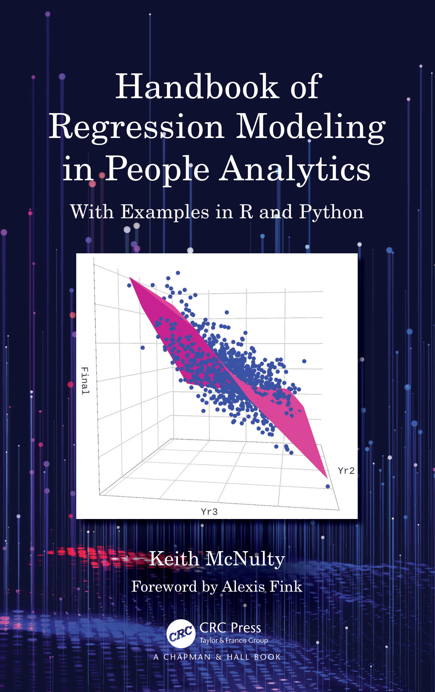

```{r setup, include=FALSE}
options(htmltools.dir.version = FALSE)
knitr::opts_chunk$set(warning = FALSE, message = FALSE)

```

class: left, middle, r-logo

## Note on source

This document is a summary learning developed for the London HR Analytics Meetup on 6 July 2021.  It is based on material in the textbook *[Handbook of Regression Modeling in People Analytics](https://www.routledge.com/Handbook-of-Regression-Modeling-in-People-Analytics-With-Examples-in-R/McNulty/p/book/9781032041742)*. Please consult this book for a deeper understanding/treatment. 

The code for this document is [here](https://github.com/keithmcnulty/peopleanalytics-regression-book/tree/master/presentations/survival_london_meetup.Rmd).

## Note on languages

This document is coded in R.  Instructions in Python are included in the Appendix.

---
class: left, middle, r-logo

## What is regression?

* Regression is a statistical method that helps relate certain input data to an outcome of interest, based on certain statistical assumptions oriented around the *Central Limit Theorem*.

* It is helpful as a way to explain how certain constructs influence (or do not influence) your outcome, but it *cannot prove causality*, which is much harder to do.

* It is an extremely useful technique in practice.  Because it is often too difficult to prove causation, decision makers use the next best thing --- proof of influence combined with expert knowledge and judgment --- in making business decisions.  

---
class: left, middle, r-logo

## How does regression help?

Given data on a set of input variables and an outcome of interest, regression analysis can estimate the following:

1.  Which of the input variables have a statistically significant influence on the outcome?
2.  'How big' is the influence of each significant variable?
3.  How much of the overall outcome do your input variables explain?

---
class: left, middle, r-logo

## Example 1 - Linear Regression

Circa 1880, Francis Galton did a study on some British children to see how their heights related to that of their parents.  Let's grab Galton's data.

```{r}
# get data from URL
url <- "https://raw.githubusercontent.com/keithmcnulty/peopleanalytics-regression-book/master/data/Galton.txt"
galton <- read.delim(url)

# view first few rows
head(galton)
```

---
class: left, middle, r-logo

## What is the relationship between mid-parent height and child height

Galton simplistically expected the child's height to be perfectly explained by the average height of their parents.  We can test that using a simple linear regression model.

```{r}
library(dplyr)

# create midParentHeight column
galton <- galton %>% 
  dplyr::mutate(midParentHeight = (Father + Mother)/2)

# simple linear regression of child vs mid-parent height
simplemodel <- lm(formula = Height ~ midParentHeight, data = galton)

# how much does it explain (R-squared)
summary(simplemodel)$r.squared
```

---
class: left, middle, r-logo

## Galton realized that children 'regress' away from their parents height towards a mean population height


```{r, echo = FALSE, fig.align="center"}
library(ggplot2)

ggplot(galton, aes(x = midParentHeight, y = Height)) +
  geom_point(color = "blue") +
  geom_jitter(color = "blue") +
  geom_function(fun = function(x) {y = x}) +
  geom_function(fun = function(x) {y = mean(galton$Height)}, linetype = "dotdash") +
  geom_smooth(method='lm', formula = y~x, se = FALSE, color = "red", linetype = "dashed") +
  xlab("Mid-Parent Height (inches)") +
  ylab("Child Height (inches)") +
  theme_minimal()
```


---
class: left, middle, r-logo

## Example 2 - Logistic Regression

In 1986, the Space Shuttle Challenger exploded shortly after take off and all on board were killed.  This started a major investigation by NASA.  Video evidence pointed to unstable structures called O-rings as the cause of the accident, and there was a strong hypothesis that these structures did not function well in colder temperatures, such as on the day of the tragic accident.

Let's get some data on the Space Shuttle launches up to and including Challengers.

```{r}
shuttles <- read.table(
  "https://archive.ics.uci.edu/ml/machine-learning-databases/space-shuttle/o-ring-erosion-only.data"
)

colnames(shuttles) <- c("total_orings", "distressed_orings", "temp", "leakcheck_psi", "order")
head(shuttles)

```

We create a new binary field called `incident` based on where there were any distressed o-rings:

```{r}
shuttles <- shuttles |> 
  dplyr::mutate(incident = ifelse(distressed_orings > 0, 1, 0))

```

---
class: left, middle, r-logo

## A simple logistic regression associates the temperature with the likelihood of o-ring failure

Now we run a logistic regression model to relate `temp` and `leakcheck_psi` to the likelihood of there being an incident:

```{r}
model <- glm("incident ~ temp + leakcheck_psi", data = shuttles, family = "binomial")

summary(model)
```

---
class: left, middle, r-logo

## Methods covered in textbook

<p>

<ul>
<li>Hypothesis testing
<li>Linear Regression
<li>Binomial Logistic Regression
<li>Multinomial Logistic Regression
<li>Proportional Odds Regression
<li>Multilevel Models
<li>Structural Equation Models
<li>Survival Analysis
<li>Power Analysis
</ul>
<ul>
<li><a href="https://www.routledge.com/Handbook-of-Regression-Modeling-in-People-Analytics-With-Examples-in-R/McNulty/p/book/9781032041742">Pre-order now</a> for print/Kindle.  All author proceeds donated to <a href="https://rladies.org/">R-ladies Global</a>
<li><a href="https://peopleanalytics-regression-book.org">Free online version</a>
</ul>
</p>


---
class: left, middle, r-logo

## Analyzing time-based event outcomes

Most elementary models analyze an outcome as at a specific point in time.  For example, in a logistic regression we might model the likelihood of high job performance (Yes or No) as at a specific performance review cycle.  In this case our outcome variable $y$ is simply 1 or 0.

Then if our input variables are $x_1, x_2, ...,x_n$, our model estimates the *odds* of $y$ being positive as

$$
\frac{P(y = 1)}{P(y = 0)} = e^{\beta_0 + \beta_1x_1 + \beta_2x_2 + ... + \beta_nx_n}
$$
where $\beta_0, \beta_1, \beta_2, ..., \beta_n$ are our coefficients which we can use to explain the influence of each input variable.

But in People Analytics, many of our outcomes can occur *at any time* after we take measures of our input variables, and we are also interested in the time effect as well as the event itself.  Common examples of this are attrition or promotion.

---
class: left, middle, r-logo

## Survival analysis

Survival analysis is family of regression-based techniques designed to understand outcome events that occur over time.  This family of techniques came into existence to research the effect of lifestyle factors, drug treatment and other interventions on adverse clinical outcomes like death or the onset of serious disease.  Medically, while it is important to understand *whether* such an outcome occurs, it is also important to understand *when* it occurs.

Key components of a basic survival analysis are:

1.  The construction of a survival outcome
2.  The calculation of Kaplan-Meier survival rates and curves
3.  Running and checking a Cox Proportional Hazard regression model

---
class: left, middle, r-logo

## Case example:  Employee surveys and attrition

*Dropping Like Flies, Inc* is a company that is experiencing very high employee attrition.  The Chief People Officer believes that the employee experience is not a major factor in this issue and that this issue is being caused be aggressive competitors 'poaching' staff.

You have been asked to find evidence to support or contradict this claim by analyzing the data on past survey responses and on employee departures.

**Key question:**. Is there a reason to believe that poor employee experience is a factor in recent attrition?


---
class: left, middle, r-logo

## Data set 1 - Survey responses from survey conducted at the end of 2018

```{r}
survey_responses <- read.csv("")

```


