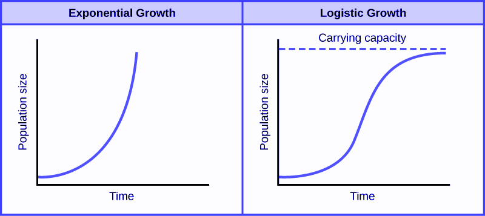

# Binomial Logistic Regression for Two-Class Outcomes

```{r setup, echo = FALSE}
knitr::opts_chunk$set(warning = FALSE, message = FALSE)

```

In the previous chapter we looked at how to explain outcomes that have continuous scale, such as quantity, money, height or weights.  While there are  a number of typical problems of this type in the people analytics domain, they are not the most common form of outcomes that are typically modeled.  Much more common are situations where the outcome of interest takes the form of a limited set of classes.  Two-class (binary) problems are very common.  In business contexts hiring, promotion and attrition are of often modeled as binary outcomes:  for example 'Promoted' or 'Not promoted'.  Even multi-class outcomes like performance, where individuals can have multiple performance ratings on an ordinal scale, are often converted to binary outcomes by dividing the performance ratings into two groups, for example 'High' and 'Not High'.

In any situation where our outcome is binary we are effectively working with probabilities.  Probability distributions are not generally linear in nature, and so we are no longer have the comfort of our inputs being *directly* linearly related to our outcome.    Therefore, direct linear regression methods such as Ordinary Least Squares regression are not well suited to outcomes of this type.  That said, linear relationships can be inferred on *transformations* of the outcome variable, which gives us a path to building interpretable models.  Hence, logistic regression is said to be in a class of *generalized linear models* or *GLMs*.  Because of the transformations of the outcome variable, the steps to interpretation of a binomial logistic regression model are a little more involved than in the previous chapter.  Understanding logistic regression and using it reliably in practice is not straightforward, but it is an invaluable skill to have in the people analytics domain.

## When to use it

### Origins and intuition of binomial logistic regression {#logistic-origins}

The *logistic function* was introduced by the Belgian Mathematician Pierre François Verhulst in the mid-1800s as a tool for modeling population growth for humans, animals and certain species of plants and fruits.  By this time, it was generally accepted that population growth could not continue exponentially forever, and that there were environmental and resource limits which place a maximum limit on the size of a population, called the 'carrying capacity'.  The formula for Verhulst's function was:

$$
y = \frac{L}{1 + e^{-k(x - x_0)}}
$$
where $e$ is the exponential constant, $x_0$ is the value of $x$ at the midpoint, $L$ is the maximum value of $y$ (the 'carrying capacity') and $k$ is the maximum gradient of the curve. 

The logistic function, as shown in Figure \@ref(fig:logistic-function-verhulst), was felt to accurately capture the theorized stages of population growths, with slower growth in the initial stage, moving to exponential growth during the intermediate stage and then to slower growth as the population approaches its carrying capacity.  

```{r logistic-function-verhulst, fig.align = "center", fig.cap = "Verhulst's Logistic Function modeled both the exponential nature and the natural limit of population expansion", echo = FALSE}




```

In the early 20th century, starting with applications in economics and in chemistry, the logistic function was adopted in a wide array of fields as a useful tool for modeling phenomena.  In statistics, it was quickly noted that the logistic function has a similar S-shape (or *sigmoid*) to a cumulative normal distribution of probability, as depicted in Figure \@ref(fig:norm-log-curves)^[The logistic function plotted in Figure \@ref(fig:norm-log-curves) takes the simple form $y = \frac{1}{1 + e^{-x}}$]).  However, the logistic function has a clear and simple mathematical formula which is easy to perform calculus on, and therefore easier to use to develop inferential models based on maximum likelihood.  So statisticians started to observe that they could work with a more 'plyable' function that was very close in nature to a normal probability distribution.  Unsurprisingly, the logistic model soon became a common approach to modeling probabilistic phenomena.

```{r norm-log-curves, fig.align = "center", fig.cap = "The logistic function is very similar to a cumulative normal distribution, but easier to work with mathematically", echo = FALSE}
library(ggplot2)

ggplot2::ggplot() +
  ggplot2::xlim(-5, 5) +
  ggplot2::geom_function(fun = pnorm, aes(color = "red")) +
  ggplot2::geom_function(fun = plogis, aes(color = "blue")) +
  scale_color_discrete(name = "Distribution Type", labels = c("Cumulative Normal", "Logistic"))
                      
  


```

### Use cases for binomial logistic regression

binomial logistic regression can be used in the following situation:

1.  The outcome of interest is binary or dichotomous in nature.  That is, it takes one of two values.  For example, one or zero, true or false, yes or no.  These classes are commonly described as 'positive' and 'negative' classes.
2.  There is more than one input variable and you need to understand the *relative* impact of each variable on the likelihood of the output being in the positive class.  If there is only one input variable, logistic regression can still be used but a Chi-squared test will produce similar results and is a generally simpler approach.

Example questions that could be approached using binomial logistic regression include:

* Given a set of data about sales managers in an organization, including performance against targets, team size, tenure in the organization and other factors, what impact do these factors have on the likelihood of the individual being a high performer? 
* Given a set of demographic, income and location data, what influence does each have on the likelihood of an individual voting in an election?
* Given a set of responses to survey questions from a set of employees and data on the employees' history with the organization, to what extent can the different survey responses explain the likelihood of an individual leaving the organization within a defined time period?

### Walkthrough example {#walkthrough-logit}

You are an analyst for a large company consisting of four regional sales teams across the country.  Twice every year, this company promotes its salespeople.  Promotion is at the discretion of the head of each regional sales team, taking into consideration financial performance, customer satisfaction ratings, recent performance ratings and personal judgment.  

You are asked by the management of the company to conduct an analysis to determine how the factors of financial performance, customer ratings and performance ratings influence the likelihood of a given salesperson being promoted.  You are provided with a dataset [here](https://raw.githubusercontent.com/keithmcnulty/eampa/master/data/salespeople.csv), containing data for the last three years of salespeople considered for promotion.  The data contains the following fields:

* `promoted`:  A binary value indicating 1 if the individual was promoted and 0 if not.
* `sales`: the sales (in $000s) attributed to the individual in the period of the promotion
* `customer_rate`:  the average satisfaction rating from a survey of the individuals customers during the promotion period
* `performance`: the most recent performance rating prior to promotion, from 1 (lowest) to 4 (highest) 

```{r}
# obtain data from online csv at github
url <- "https://raw.githubusercontent.com/keithmcnulty/eampa/master/data/salespeople.csv"
salespeople <- read.csv(url)

# look at the first few rows of data
head(salespeople)

```
The data looks as expected.  Let's get a summary of the data:

```{r}
summary(salespeople)
```

We see that about a third of individuals were promoted, that sales ranged from \$150k to \$940k, that as expected the satisfaction ratings range from 1 to 5, and finally we see four performance ratings, although the performance categories are numeric when they should be an ordered factor, and `promoted` is numeric when it should be categorical.   Let's convert these and then let's do a pairplot to get a quick view on some underlying relationships:

```{r, warning = FALSE, message = FALSE}
library(ggplot2)
library(GGally)

#convert performance to ordered factor and promoted to categorical
salespeople$performance <- ordered(salespeople$performance, levels = 1:4)
salespeople$promoted <- as.factor(salespeople$promoted)

# generate pairplot
GGally::ggpairs(salespeople)


```

We can see from this pairplot that there are clearly higher sales for those who are promoted versus those who are not.  We also see a moderate relationship between customer rating and sales, which is intuitive (if the customer doesn't like you, sales wouldn't likely be very high).

So we can see that some relationships with our outcome may exist here, but it's not clear how to tease them out and quantify them relative to each other.  Let's explore how binomial logistic regression can help us do this.


## Modeling probabilistic outcomes using a logistic function

Imagine that you have an outcome $y$ which either occurs or does not occur.  The probability of $y$ occurring, or $P(y = 1)$, obviously takes the a value between 0 and 1.  Now imagine that some input variable $x$ has a positive effect on the probability of the event taking place.  Then you would naturally expect $P(y = 1)$ to increase as $x$ increases.

In our `salespeople` data set, let's plot our `promotion` outcome against the `sales` input.  This can be seen in Figure \@ref(fig:prom-sales-plot).

```{r prom-sales-plot, fig.cap = "Plot of promotion against sales in `salespeople` data set", fig.align="center", echo = FALSE}

ggplot2::ggplot(data = salespeople, aes(x = sales, y = promoted)) +
  ggplot2::geom_point()

```

It's clear that the probability of promotion increases according to the sales level, with a lower limit of zero and an upper limit of 1.  We could try to model this probability using our logistic function which we learned about in \@ref(logistic-origins).  For example, let's plot the logistic function 
$$
P(y = 1) = \frac{1}{1 + e^{-k(x - x_{0})}}
$$ 

on this data, where we set $x_0$ to the the mean of `sales` and $k$ to be some gradient value.   In \@ref(fig:prom-with-logistic), we can see these logistic functions for gradients of one standard deviation of `sales`, half a standard deviation of `sales` and one quarter of a standard deviation of `sales`.  All of these seem to reflect the pattern we are observing to some extent, but how do we determine the best fitting logistic function?

```{r prom-with-logistic, fig.cap = "Overlaying logistic functions with various gradients onto previous plot", fig.align="center", echo = FALSE}

ggplot2::ggplot(data = salespeople, aes(x = sales, y = promoted)) +
  ggplot2::geom_point() +
  ggplot2::geom_function(fun = function(x) plogis(x, mean(salespeople$sales), sd(salespeople$sales)), aes(color = "red")) +
  ggplot2::geom_function(fun = function(x) plogis(x, mean(salespeople$sales), 0.5*sd(salespeople$sales)), aes(color = "blue")) +
  ggplot2::geom_function(fun = function(x) plogis(x, mean(salespeople$sales), 0.25*sd(salespeople$sales)), aes(color = "green")) +
  ggplot2::scale_color_discrete(name = "Gradient", labels = c("red" = "Full SD", "blue" = "Half SD", "green" = "Quarter SD") )

```

### Deriving the concept of log-odds

Let's look more carefully at the index of $e$ in the denominator of our logistic function.  Note that, because $x_{0}$ is a constant. we have:

$$
-k(x - x_{0}) = -kx - kx_{0} = - (\beta_{0} + \beta_1x)
$$
for some values of $\beta_{0}$ and $\beta_{1}$.  Therefore,

$$
P(y = 1) = \frac{1}{1 + e^{-(\beta_0 + \beta_1x)}}
$$

Now we know that for any binary event $y$, $P(y = 0) = 1 - P(y = 1)$, so 

$$
P(y = 0) = 1 - \frac{1}{1 + e^{-(\beta_1x + \beta_0)}}
$$

Putting these together, and using some manipulation, we find that

$$
\frac{P(y = 1)}{P(y = 0)} = e^{\beta_0 + \beta_1x}
$$

or alternatively

$$
\log\left(\frac{P(y = 1)}{P(y = 0)}\right) = \beta_0 + \beta_1x
$$

The right hand side should look familiar from the previous chapter on linear regression, meaning there is something here we can model linearly.  But what is the left hand side?

$P(y = 1)$ is the probability that the event will occur, while $P(y = 0)$ is the probability that the event will not occur.  You may be familiar from sports like horse racing or other gambling situations that the ratio of these two represents the *odds* of an event occurring.  For example, if a given horse has odds of 1:4, this means that there is a 20% probability they will win and an 80% probability they will lose^[Often they are expressed in the reverse order but the concept is the same].

Therefore we can conclude that the *log odds* of $y$ are linear in $x$ and therefore we can model the log odds of $y$ using similar linear regression methods to those studied in Chapter \@ref(linear-reg-ols)^[In this case a more general form of the Ordinary Least Squares procedure is used to fit the model, known as *maximum likelihood*.].

### Modeling the log odds and interpreting the coefficients

Let's take our simple case of regressing `sales` against the outcome of `promoted`.  Although you would not usually choose to run a logistic regression model on a single output, we will do it here for illustration purposes before moving onto the multinomial case.  We use a standard binomial GLM function and our standard formula notation which we learned in the previous chapter.

```{r}
# run a binomial model 
simple_model <- glm(formula = promoted ~ sales, data = salespeople, family = "binomial")

# view the coefficients
simple_model$coefficients

```

We can interpret the coefficients as follows:

1. The `(Intercept)` coefficient is the value of the log odds with zero input value of $x$.  It is effectively the log odds of promotion if you made no sales.  

2.  The `sales` coefficient represents the increase in the log odds of promotion associated with each unit increase in sales.

We can convert these coefficients from log odds to simple odds by applying the exponent function, to return to the identity we had previously

$$
\frac{P(y = 1)}{P(y = 0)} = e^{\beta_0 + \beta_1x} = e^{\beta_0}(e^{\beta_1})^x
$$

From this, we can interpret that $e^{\beta_0}$ represents the base odds of promotion assuming no sales, and that for every additional unit sales, those base odds are multiplied by $e^{\beta_1}$.  Given this multiplicative effect that $e^{\beta_1}$ has on the odds, it is known as an *odds ratio*.  

```{r}
# convert log odds to base odds and odds ratio
exp(simple_model$coefficients)
```

So, we can see that the base odds of promotion with zero sales, is very close to zero, which makes sense. Note that odds can only be precisely zero in a situation where it is impossible to be in the positive class (eg nobody gets promoted).  We can also see that each unit (that is, every \$1000) of sales multiplies the base odds by approximately `r round(exp(simple_model$coefficients[2]), 2)` - in other words it increases the odds of promotion by `r round(exp(simple_model$coefficients[2])*100 - 100)`%.

### Odds versus probability

It is worth spending a little time understanding the concept of odds and how it relates to probability.  It is extremely common for these two terms to be used synonymously, and this can lead to serious misunderstandings when interpreting a logistic regression model.

If a certain event has a probability of 0.1, then this means that its odds are 1:9, or 0.111.  If the probability is 0.5, then the odds are 1, if the probability is 0.9, then the odds are 9, and if the probability is 0.99, the odds are 99.  As we approach a a probability of 1, the odds become exponentially large, as illustrated in Figure \@ref(fig:odds-prob):

```{r odds-prob, fig.cap="Odds plotted against probability", fig.align="center", echo = FALSE, message = FALSE, warning = FALSE}

library(latex2exp)

ggplot2::ggplot() +
  xlim(0, 1) +
  ylim(0, 100) +
  geom_function(fun = function (x) {x/(1-x)}, colour = "black") +
  xlab("Probability") +
  ylab("Odds")

```

The consequences of this is that a given increase in odds can have very different effects on probability depending on what original probability was in the first place.  If the probability was already quite low, for example 0.1, then a 4% increase in odds translates to odds of `r round((1/9)*1.04, 3)` which translates to a new probability of `r round((0.1*1.04)/(1 + 0.1*0.04), 6)`, representing an increase in probability of `r round((0.1*1.04)/(1 + 0.1*0.04)*100/0.1, 2) - 100`%, which is very close to the increase in odds.  If the probability was already high, say 0.9, then a 4% increase in odds translates to odds of `r round((9/1)*1.04, 3)`, which translates to a new probability of `r round((0.9*1.04)/(1 + 0.9*0.04), 6)` representing an increase in probability of `r round((0.9*1.04)/(1 + 0.9*0.04)*100/0.9, 2) - 100`%, which is very different from the increase in odds.  Figure \@ref(fig:pcoddsplot) shows the impact of a 4% increase in odds according to the original probability of the event.

```{r pcoddsplot, fig.cap="Effect of 4% increase in odds plotted against original probability", fig.align="center", echo = FALSE, message = FALSE, warning = FALSE}

library(latex2exp)

ggplot2::ggplot() +
  xlim(0, 1) +
  ylim(0, 0.05) +
  ylab("Increase in probability") +
  xlab("Original probability") +
  geom_function(fun = function (x) {(x * 1.04)/(1 + x * 0.04)/x - 1}, colour = "black") 

```


We can see that the closer the base probability is to zero, the similar the effect of the increase on both odds and on probability.  However, the higher the probability of the event, the less impact the increase in odds has.  In any case, it's useful to remember the formulas for convertings odds to probability and vice-versa.  If $O$ represents odds and $P$ represents probability then we have:

$$
O = \frac{P}{1 - P} \\
P = \frac{O}{1 + O}
$$

## Running a multivariate logistic regression model

The derivations in the previous section easily extend to multivariate data.  Let $y$ by a dichotomous outcome and let $x_1, x_2, ..., x_p$ be our input variables.  Then

$$
\log\left(\frac{P(y = 1)}{P(y = 0)}\right) = \beta_0 + \beta_1x_1 + \beta_2x_2 + ... + \beta_px_p
$$
for coefficients $\beta_0, \beta_1,..., \beta_p$.  As before:

* $\beta_0$ represents the log odds of our outcome when all inputs are zero
* Each $\beta_i$ represents the increase in the log odds of our outcome associated with a unit change in $x_i$.

Applying an exponent as before, we have

$$
\begin{align*}
\frac{P(y = 1)}{P(y = 0)} &= e^{\beta_0 + \beta_1x_1 + \beta_2x_2 + ... + \beta_px_p} \\
&= e^{\beta_0}(e^{\beta_1})^{x_1}(e^{\beta_2})^{x_2}...(e^{\beta_p})^{x_p} 
\end{align*}
$$
Therefore we can conclude that:

* $e^{\beta_0}$ represents the odds of the outcome when all inputs are zero
* Each $e^{\beta_i}$ represents the *odds ratio* associated with a unit increase in $x_i$ assuming no change in the other inputs (that is, a unit increase in $x_i$ multiplies the odds of our outcome by $e^{\beta_i}$).  Let's put this into practice.

### Running and interpreting a multivariate logistic regression model

Let's use a binomial logistic regression model to understand how each of the three inputs in out `salespeople` data set influences the likelihood of promotion.

First, as we learned previously, it is good practice to convert the categorical `performance` variable to a dummy variable^[Note that most standard modeling functions have a built in capability to deal with categorical variables, meaning that it's often not necessary to explicitly construct dummies.  However, it is shown here for completion sake.  You may wish to try running the subsequent code without explicitly constructing dummies]. 

```{r}
library(dummies)

# convert performance to dummy
perf_dummies <- dummies::dummy("performance", data = salespeople)

# replace in salespeople dataframe

salespeople_dummies <- cbind(salespeople[c("promoted", "sales", "customer_rate")], perf_dummies)
head(salespeople_dummies)
```

Now we can run our mode (using the formula `promoted ~ .` to mean regressing `promoted` against everything else) and view our coefficients.

```{r}
# run binomial glm
full_model <- glm(formula = "promoted ~ .",
                  family = "binomial",
                  data = salespeople_dummies)

# get coefficient summary 
(coefs <- summary(full_model)$coefficients)
```

Note how only three of the `performance` dummies have displayed.  This is because the model is using `performance4` as the base case, so we can interpret each `performance` coefficient as the effect of a move to that performance category from `performance4`.

We can already see from the `P (> |z|)` column that only `sales` and `customer_rate` meet the significance threshold of less than 0.05.  Interestingly, it appears from the `Estimate` column that `customer_rate` has a negative effect on the log odds of promotion.    We can add an extra column to create the exponents of our estimated coefficients so that we can see the odds ratios:

```{r}
(full_coefs <- cbind(coefs, odds_ratio = exp(full_model$coefficients))) 
```

Now we can interpret our model as follows:

* Sales have a significant positive effect on the likelihood of promotion, with each additional thousand dollars of sales increasing the odds of promotion by 4%.
* Customer ratings have a significant negative effect on the likelihood of promotion.  One full rating higher is associated with 67% lower odds of promotion.
* Performance ratings have no significant effect on the likelihood of promotion.

The second conclusion may appear counterintuitive, but remember from our pairplot in \@ref(walkthrough-logit) that there is already moderate correlation between sales and customer ratings, and this model will be controlling for that relationship. Recall that our odds ratios act *assuming all other variables are the same*.  Therefore, if two individuals have the same sales, the one with the lower customer rating is more likely to have been promoted.  Similarly, if two individuals have the same level of sales and the same customer rating, their performance rating will have no significant bearing on the likelihood of promotion.

Similar to other regression models, the unit scale needs to be taken into consideration during interpretation.  On first sight, a decrease of 67% in odds seems a lot more important than an increase of 4% in odds.  However, the increase of 4% is for one unit ($000) in many thousands of sales units, and over 10 or 100 additional units can have a substantial compound effect on odds of promotion.  The decrease of 67% is on a full customer rating point on a scale of only 4 full points.  

