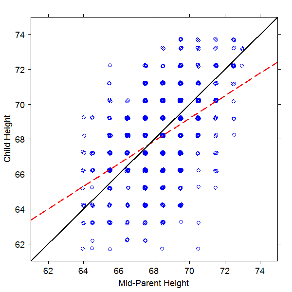

# Linear Regression for Continuous Outcomes {#linear-reg-ols}

In this chapter we will introduce and explore linear regression, one of the first learning methods to be developed by statisticians and one of the easiest to interpret.  Despite its simplicity - indeed *because* of its simplicity - it can be a very powerful tool in many situations.  Linear regression will often be the first methodology to be trialled on a given problem, and will give an immediate benchmark with which to judge the efficacy of other, more complex, modeling techniques.  Given the ease of interpretation, many analysts will select a linear regression model over more complex approaches even if those approaches produce a slightly better fit.  This chapter will also introduce many critical concepts that will apply to other modeling approaches as we proceed through this book, therefore for inexperienced modelers this should be considered a foundational chapter which should not be skipped.

## When to use it {#when-ols}

### Origins and Intuition of Linear Regression {#origins-ols}

```{r, echo = FALSE}
knitr::opts_chunk$set(warning = FALSE, message = FALSE)
library(latex2exp)

```

Linear Regression, also known as *Ordinary Least Squares Linear Regression* or *OLS Regression* for short, was developed independently by the mathematicians Gauss and Legendre at or around the first decade of the 19th century, and there remains today some controversy about who should take credit for its discovery.  However,  at the time of its discovery it was not actually known as "regression".  This term became more popular following the work of Francis Galton - a British intellectual jack-of-all-trades and a cousin of Charles Darwin.  In the late 1800s, Galton had researched the relationship between the heights of a population of almost 1,000 children and the average height of their parents (mid-parent height).  He was surprised to discover that the height of parents was not a perfect predictor of the height of children, and that in general children's heights were more likely to be in a 'narrower' range that was closer to the mean for the total population.  He described this statistical phenomenon as a "regression towards mediocrity" ("regression" comes from a Latin term approximately meaning "go back").  

Figure \@ref(fig:galton-fig) is an illustration of Galton's data with the black solid line showing what a perfect relationship would look like, and the red dashed line showing the actual relationship he determined.  You can regard the red dashed line as 'going back' from the perfect relationship (symbolized by the black line) in the direction of a flat line representing the mean of the child heights.  This might give you an intuition that will help you understand later sections of this chapter. In an arbitrary data set, the red dashed line can lie anywhere between a flat line at the mean of $y$ (no relationship) and the solid black line (a perfect relationship). Linear Regression is about finding the red dashed line in your data and using it to explain the degree to which your input data (the $x$ axis) explains or predicts your outcome data (the $y$ axis). 

```{r galton-fig, fig.cap="Galton's study of the height of children introduced the term 'regression'", out.width='80%', fig.asp=.75, fig.align='center', echo = FALSE}

```

### Use cases for Linear Regression {#use-cases-ols}

Linear regression is particularly suited to a problem where:

1.  The outcome of interest is on some sort of continuous scale (for example quantity, money, height, weight)
2.  There is reason to believe that the relationship between the outcome and the inputs can be approximated linearly

In reality, number 2 is not that easy to determine with any certainty, although running some simple bivariate correlations between inputs and outcome can give a sense of linearity/non-linearity.  Linear Regression can be a first port of call before trying more complex modeling approaches.  It is simple and easy to explain, and analysts will often accept a somewhat poorer fit using Linear Regression in order to avoid having to interpret a more complex model. 

Here are some illustratory examples of questions that could be (at least initially) tackled with a Linear Regression approach:

* Given a data set of age, education level, education discipline, years of employment, industry employed in and current salary, to what extent can current salary be explained by the rest of the data?

* Given annual test scores for a set of students over a four year period, what is the relationship between the final test score and earlier test scores?

* Given information on the demographics, personal characteristics and prior qualifications of a set of PhD students, to what degree can these explain the time taken to complete their studies?

### Walkthrough Example {#walkthrough-ols}

You are working as an analyst for the Biology Department of a large academic institution, which offers a four year Undergraduate degree program.  The academic leaders of the department are interested in understanding how student performance in the final year examination of the degree program relates to performance in the prior three years. 

To help with this, you have been provided with data for 975 individuals graduating in the past three years, and you have been asked to create a model to explain each individual's final examination score based on their examination scores for the first three years of their program.  The Year 1 examination scores are awarded on a scale of 0-100, Years 2 and 3 on a scale of 0-200, and the Final year is awarded on a scale of 0-300.

The dataset is [here](https://raw.githubusercontent.com/keithmcnulty/eampa/master/data/ugtests.csv), and we will load it into our session and take a brief look at it.

```{r}
# obtain data from online csv at github
url <- "https://raw.githubusercontent.com/keithmcnulty/eampa/master/data/ugtests.csv"
ugtests <- read.csv(url)

# look at the first few rows of data
head(ugtests)
```

The data looks as expected, with test scores for four years all read in as numeric data types, but of course this is only a few rows.  We need a quick statistical and structural overview of the data.

```{r}
# view structure
str(ugtests)

# view statistical summary
summary(ugtests)

```

We can see that the results do seem to have different scales in the different years as we have been informed, and judging by the means, students seem to have found Year 2 exams more challenging.  We can also be assured that there is no missing data, as these would have been displayed as `NA` counts in our summary if they existed.

We can also plot our four years of test scores pairwise to see any initial relationships of interest.

```{r pairplot-ugtests, fig.cap = "Pairplot of the `ugtests` data set", fig.align = "center"}
library(ggplot2)
library(GGally)

# display a pair plot of all four columns of data
GGally::ggpairs(ugtests)

```

In the diagonal we can see the distributions of the data in each column.  We observe relatively normal looking distributions in each year.  We can see scatter plots and pairwise correlation statistics off the diagonal.  For example, we see a particularly strong correlation between `Yr3` and `Final` test scores, a moderate correlation between `Yr2` and `Final` and relative independence elsewhere.


## Simple Linear Regression {#simple-ols}

In order to visualize our approach and improve our intuition, we will start with *simple* linear regression, which is the case where there is only a single input variable and outcome variable.

### Linear relationship between a single input and an outcome {#linear-single}

Let our input variable be $x$ and our outcome variable be $y$.  Recalling the equation of a straight line, because we assume that the relationship is linear, we expect the relationship to be of the form:

$$y = mx + c$$
where $m$ represents the slope or gradient of the line, and $c$ represents the point at which the line intercepts the $y$ axis.  When using a straight line to model a relationship in the data, we call $c$ and $m$ the *coefficients* of the model.

Now let's assume that we have a sample of ten datapoints with which to estimate our linear relationship.  Let's take the first ten values of `Yr3` and `Final` in our `ugtests` dataset:

```{r}
(d <- head(ugtests[ , c("Yr3", "Final")], 10))
```

We can do a simple plot of these data points as in Figure \@ref(fig:sample-plot):

```{r sample-plot, fig.cap = "Basic scatter plot of ten datapoints", fig.align = "center", echo = FALSE}
ggplot2::ggplot(data = d, aes(x = Yr3, y = Final)) +
  ggplot2::geom_point()
```

Intuitively, we can imagine a line passing through these points that 'fits' the general pattern.  For example, taking $m = 1.2$ and $c = 5$, the resulting line $y = 1.2x + 5$ could  fit between the points we are given, as displayed in Figure \@ref(fig:sample-plot-fit):

``` {r sample-plot-fit, fig.cap = "Fitting $y=1.2x + 5$ to our ten datapoints", fig.align = "center", echo = FALSE}
ggplot2::ggplot(data = d, aes(x = Yr3, y = Final)) + 
  ggplot2::geom_point() +
  ggplot2::geom_function(fun = function(x) {1.2*x + 5}, colour = "red", linetype = "dashed") +
  ggplot2::annotate("text", x = 140, y = 160, label = "y = 1.2x + 5", colour = "red")

```

This looks like an approximation of the relationship, but how do we know that it is the best approximation?  

### Minimising the error {#minimising-error-ols}

For each of our data points, we can determine an error in the fitted model by calculating the difference between the real value of $y$ and the one predicted by our model.  For example, at $x = 52$, our modeled value of y is `r 1.2*52 + 5`, but the real value is 93, producing an error of `r 93 - 1.2*52 - 5`.  These errors are known as the *residuals* of our model. The residuals for the ten points in our dataset are illustrated by the solid red line segments in Figure \@ref(fig:sample-plot-residuals).  It looks like at least one of our residuals is pretty large.


``` {r sample-plot-residuals, fig.cap = "Residuals of $y=1.2x + 5$ for our ten datapoints", fig.align = "center", echo = FALSE}
ggplot2::ggplot(data = d, aes(x = Yr3, y = Final)) + 
  ggplot2::geom_point() +
  ggplot2::geom_function(fun = function(x) {1.2*x + 5}, colour = "red", linetype = "dashed") +
  ggplot2::annotate("text", x = 137, y = 152, label = "y = 1.2x + 5", colour = "red") +
  ggplot2::geom_segment(aes(x = Yr3[1], y = 1.2*Yr3[1] + 5, xend = Yr3[1], yend = Final[1]), color = "red") +
  ggplot2::geom_segment(aes(x = Yr3[2], y = 1.2*Yr3[2] + 5, xend = Yr3[2], yend = Final[2]), color = "red") +
  ggplot2::geom_segment(aes(x = Yr3[3], y = 1.2*Yr3[3] + 5, xend = Yr3[3], yend = Final[3]), color = "red") +
  ggplot2::geom_segment(aes(x = Yr3[4], y = 1.2*Yr3[4] + 5, xend = Yr3[4], yend = Final[4]), color = "red") +
  ggplot2::geom_segment(aes(x = Yr3[5], y = 1.2*Yr3[5] + 5, xend = Yr3[5], yend = Final[5]), color = "red") +
  ggplot2::geom_segment(aes(x = Yr3[6], y = 1.2*Yr3[6] + 5, xend = Yr3[6], yend = Final[6]), color = "red") +
  ggplot2::geom_segment(aes(x = Yr3[7], y = 1.2*Yr3[7] + 5, xend = Yr3[7], yend = Final[7]), color = "red") +
  ggplot2::geom_segment(aes(x = Yr3[8], y = 1.2*Yr3[8] + 5, xend = Yr3[8], yend = Final[8]), color = "red") +
  ggplot2::geom_segment(aes(x = Yr3[9], y = 1.2*Yr3[9] + 5, xend = Yr3[9], yend = Final[9]), color = "red") +
  ggplot2::geom_segment(aes(x = Yr3[10], y = 1.2*Yr3[10] + 5, xend = Yr3[10], yend = Final[10]), color = "red")
```

The total error of our model, which we want to minimize could be defined in a number of ways:

1.  The sum of the residuals
2.  The sum of the *absolute values* of our residuals (so that negative values are converted to positive values)
3.  The sum of the squares of our residuals (note that all squares are positive)

For a number of reasons (not least that fact that at the time this method was developed it was one of the easiest to calculate manually), the most common approach is number 3, which is why we call our regression model *Ordinary Least Squares* regression.  Some algebra and calculus can help us determine the equation of the line that generates the least squared residual error.  For more of the theory behind this, consult @linear, but let's look at how this works in practice.  

### Determining the best fit {#best-fit-simple-ols}

We can run a fairly simple function in R to calculate the best fit linear model for our data.  Once we have run that function, the model, and all the details, will be saved in our session for further investigation or use.

First we need to express the model we are looking to calculate as a formula.  In this simple case we want to regress the outcome $y =$ `Final` against the input $x =$ `Yr3`, and therefore we would use the simple formula notation `Final ~ Yr3`.  Now we can use the `lm()` function to calculate the linear model based on our dataset and our formula.

```{r}
## calculate model
model <- lm(formula = Final ~ Yr3, data = d)

```
The `model` object that we have created is a list of a number of different pieces of information, which we can see by looking at the names of the objects in the list:

```{r}
names(model)

```
So we can already see some terms we are familiar with.  For example, we can look at the coefficients:
```{r}
model$coefficients

```
This tells us that that our best fit model - the one that minimises the sum of the squares of the residuals -  is $y = 1.14x + 16.63$.  In other words, our `Final` test score can be expected to take a value of 16.63 even with zero score in the `Yr3` input, and that every additional point scored in `Yr3`  will increase the `Final` score by 1.14.

### Measuring the fit of the model

We have calculated a model which minimizes the sum of squares residual error for the sample of data that we have, but we don't really have a sense of how 'good' the model is.  How do we tell how well our model uses the input data to explain the outcome?   This is an important question to answer because you would not want to propose a model that does not do a good job of explaining your outcome, and you also may need to compare your model to other alternatives, which will require some sort of benchmark metric.

One natural way to benchmark how good a job your model does of explaining the outcome is to compare it to a situation where you have no input and no model at all.  In this situation, all you have is your outcome values which can be considered a random variable with a mean and a variance.  In the case of our ten datapoints, we have ten values of `Final` with a mean of `r round(mean(d$Final), 2)`.  We can consider the horizontal line representing the mean of $y$ as our 'random model', and we can calculate the residuals around the mean.  This can be seen in Figure \@ref(fig:model-mean).

```{r model-mean, fig.cap = "Residuals of our ten datapoints around their mean value", fig.align = "center", echo = FALSE}
ggplot2::ggplot(data = d, aes(x = Yr3, y = Final)) +
  ggplot2::geom_point() +
  ggplot2::geom_function(fun = function(x) mean(d$Final), color = "blue", linetype = "dashed") +
  ggplot2::annotate("text", x = 65, y = 137, label = "y = 133.70", colour = "blue") +
  ggplot2::geom_segment(aes(x = Yr3[1], y = round(mean(Final), 2), xend = Yr3[1], yend = Final[1]), color = "blue") +
  ggplot2::geom_segment(aes(x = Yr3[2], y = round(mean(Final), 2), xend = Yr3[2], yend = Final[2]), color = "blue") +
  ggplot2::geom_segment(aes(x = Yr3[3], y = round(mean(Final), 2), xend = Yr3[3], yend = Final[3]), color = "blue") +
  ggplot2::geom_segment(aes(x = Yr3[4], y = round(mean(Final), 2), xend = Yr3[4], yend = Final[4]), color = "blue") +
  ggplot2::geom_segment(aes(x = Yr3[5], y = round(mean(Final), 2), xend = Yr3[5], yend = Final[5]), color = "blue") +
  ggplot2::geom_segment(aes(x = Yr3[6], y = round(mean(Final), 2), xend = Yr3[6], yend = Final[6]), color = "blue") +
  ggplot2::geom_segment(aes(x = Yr3[7], y = round(mean(Final), 2), xend = Yr3[7], yend = Final[7]), color = "blue") +
  ggplot2::geom_segment(aes(x = Yr3[8], y = round(mean(Final), 2), xend = Yr3[8], yend = Final[8]), color = "blue") +
  ggplot2::geom_segment(aes(x = Yr3[9], y = round(mean(Final), 2), xend = Yr3[9], yend = Final[9]), color = "blue") +
  ggplot2::geom_segment(aes(x = Yr3[10], y = round(mean(Final), 2), xend = Yr3[10], yend = Final[10]), color = "blue")

```

Recall from our previous chapter the definition of the population variance of $y$, notated as $\mathrm{Var}(y)$.  Note that it is defined as the average of the squares of the residuals around the mean of $y$. Therefore $\mathrm{Var}(y)$ represents the mean sum of squares error of a random model.  This calculates in this case to `r round((5/6)*var(d$Final), 2)`.

Now let's overlay our fitted model onto this random model in Figure \@ref(fig:model-overlay):

```{r model-overlay, fig.cap = "Comparison of residuals of fitted model (red) against random variable (blue)", fig.align = "center", echo = FALSE}
ggplot2::ggplot(data = d, aes(x = Yr3, y = Final)) +
  ggplot2::geom_point() +
  ggplot2::geom_function(fun = function(x) mean(d$Final), color = "blue", linetype = "dashed") +
  ggplot2::annotate("text", x = 65, y = 137, label = "y = 133.70", colour = "blue") +
  ggplot2::geom_segment(aes(x = Yr3[1], y = round(mean(Final), 2), xend = Yr3[1], yend = Final[1]), color = "blue") +
  ggplot2::geom_segment(aes(x = Yr3[2], y = round(mean(Final), 2), xend = Yr3[2], yend = Final[2]), color = "blue") +
  ggplot2::geom_segment(aes(x = Yr3[3], y = round(mean(Final), 2), xend = Yr3[3], yend = Final[3]), color = "blue") +
  ggplot2::geom_segment(aes(x = Yr3[4], y = round(mean(Final), 2), xend = Yr3[4], yend = Final[4]), color = "blue") +
  ggplot2::geom_segment(aes(x = Yr3[5], y = round(mean(Final), 2), xend = Yr3[5], yend = Final[5]), color = "blue") +
  ggplot2::geom_segment(aes(x = Yr3[6], y = round(mean(Final), 2), xend = Yr3[6], yend = Final[6]), color = "blue") +
  ggplot2::geom_segment(aes(x = Yr3[7], y = round(mean(Final), 2), xend = Yr3[7], yend = Final[7]), color = "blue") +
  ggplot2::geom_segment(aes(x = Yr3[8], y = round(mean(Final), 2), xend = Yr3[8], yend = Final[8]), color = "blue") +
  ggplot2::geom_segment(aes(x = Yr3[9], y = round(mean(Final), 2), xend = Yr3[9], yend = Final[9]), color = "blue") +
  ggplot2::geom_segment(aes(x = Yr3[10], y = round(mean(Final), 2), xend = Yr3[10], yend = Final[10]), color = "blue") +
  ggplot2::geom_function(fun = function(x) {model$coefficients[2]*x + model$coefficients[1]}, colour = "red", 
                         linetype = "dashed") +
  ggplot2::annotate("text", x = 100, y = 110, label = "y = 1.14x + 16.63", colour = "red") +
  ggplot2::geom_segment(aes(x = Yr3[1], y = model$fitted.values[1], xend = Yr3[1], yend = Final[1]), color = "red") +
  ggplot2::geom_segment(aes(x = Yr3[2], y = model$fitted.values[2], xend = Yr3[2], yend = Final[2]), color = "red") +
  ggplot2::geom_segment(aes(x = Yr3[3], y = model$fitted.values[3], xend = Yr3[3], yend = Final[3]), color = "red") +
  ggplot2::geom_segment(aes(x = Yr3[4], y = model$fitted.values[4], xend = Yr3[4], yend = Final[4]), color = "red") +
  ggplot2::geom_segment(aes(x = Yr3[5], y = model$fitted.values[5], xend = Yr3[5], yend = Final[5]), color = "red") +
  ggplot2::geom_segment(aes(x = Yr3[6], y = model$fitted.values[6], xend = Yr3[6], yend = Final[6]), color = "red") +
  ggplot2::geom_segment(aes(x = Yr3[7], y = model$fitted.values[7], xend = Yr3[7], yend = Final[7]), color = "red") +
  ggplot2::geom_segment(aes(x = Yr3[8], y = model$fitted.values[8], xend = Yr3[8], yend = Final[8]), color = "red") +
  ggplot2::geom_segment(aes(x = Yr3[9], y = model$fitted.values[9], xend = Yr3[9], yend = Final[9]), color = "red") +
  ggplot2::geom_segment(aes(x = Yr3[10], y = model$fitted.values[10], xend = Yr3[10], yend = Final[10]), color = "red")

```

So for most of our observations (though not all) we seem to have reduced the 'distance' from the random model by fitting our new model.  If we average the square of our residuals for the fitted model, we obtain the mean sum of squares error of our fitted model, which calculates to `r round(sum(model$residuals^2)/6, 2)`.

Therefore before we fit our model, we have an average error of `r round((5/6)*var(d$Final), 2)`, and after we fit it, we have an average error of `r round(sum(model$residuals^2)/6, 2)`.  So we have reduced the average error of our model by `r round((5/6)*var(d$Final), 2) - round(sum(model$residuals^2)/6, 2)` or, expressed as a proportion, by `r round((round((5/6)*var(d$Final), 2) - round(sum(model$residuals^2)/6, 2))/((5/6)*var(d$Final)), 2)`.  In other words, we can say that our model explains `r  round(((5/6)*var(d$Final) - sum(model$residuals^2)/6)/((5/6)*var(d$Final)), 2)` (or `r  round(((5/6)*var(d$Final) - sum(model$residuals^2)/6)/((5/6)*var(d$Final)), 2) * 100`%) of the variance of our outcome.  

This metric is known as the $R^2$ of our model and is the primary metric used in measuring the fit of a linear regression model^[As a side note, in a simple regression model like this, where there is only one input variable, we have the simple identity $R^2 = r^2$, where $r$ is the correlation between the input and outcome (for our small set of ten datapoints here, the correlation is `r round(cor(d$Yr3, d$Final), 3)`)]. 


## Multiple linear regression {#multiple-linear-regression}

In reality, regression problems rarely involve one single input variable, but rather multiple variables. The methodology for multiple linear regression is similar in nature to a simple linear regression, but obviously more difficult to visualize because of its increased dimensionality.

In this case, our input is a set of $p$ variables $x_1, x_2, ..., x_p$.  Extending the linear equation in Figure \@ref(linear-single), we seek to develop an equation of the form:

$$y = \beta_0 + \beta_1x_1 + \beta_2x_2 + ... + \beta_px_p$$
so that our sum of squares residual error is minimized.  

### Running a multiple linear regression model and interpreting its coefficients

A multiple linear regression model is run is a similar way to a simple regression model, with your formula notation determining what outcome and input variables you wish to have in your model.  Let's now perform a multiple linear regression on our entire `ugtests` dataset and regress our `Final` test score against all prior test scores using the formula `Final ~ Yr3 + Yr2 + Yr1` and determine our coefficients as before.

```{r}
model <- lm(data = ugtests, formula = Final ~ Yr3 + Yr2 + Yr1)
model$coefficients

```


Referring to our formula in Section \@ref(multiple-linear-regression), let's understand what each coefficient $\beta_0, \beta_1, ..., \beta_p$ means.  $\beta_0$, the *intercept* of the model, represents the value of $y$ assuming that all the inputs were zero.  You can imagine that your output can be expected to have a base value even without any inputs - a student who completely flunked the first three years can still redeem themselves to some extent in the Final year.

Now looking at the other coefficients, let's consider what happens if our first input $x_1$ increased by a single unit, assuming nothing else changed.  We would then expect our value of y to increase by $\beta_1$.  Similarly for any input $x_k$, a unit increase would result in an increase in $y$ of $\beta_k$, assuming no other changes in the inputs. 

In the case of our `ugtests` dataset, we can say the following:

* The intercept of the model is `r round(model$coefficients[1], 3)`.  This is the value that a student could be expected to score in their final exam even if they had scored zero in all previous exams.

* The `Yr3` coefficient is `r round(model$coefficients[2], 3)`.  Assuming no change in other inputs, this is the increase in the Final exam score that could be expected from an extra point in the Year 3 score. 

* The `Yr2` coefficient is `r round(model$coefficients[3], 3)`.  Assuming no change in other inputs, this is the increase in the Final exam score that could be expected from an extra point in the Year 2 score. 

* The `Yr1` coefficient is `r round(model$coefficients[4], 3)`.  Assuming no change in other inputs, this is the increase in the Final exam score that could be expected from an extra point in the Year 1 score. 

### Coefficient confidence

Intuitively, these coefficients appear too precise for comfort.  After all, we are attempting to estimate a relationship based on a limited set of data.  In particular, looking at the `Yr1` coefficient, it seems to be very close to zero, implying that there is a possibility that the Year 1 examination score has no impact on the final examination score.  Like in any statistical estimation, the coefficients calculated for our model have a margin of error.  Typically, in any such situation, we seek to know a 95% confidence interval to set a standard of certainty around the values we are interpreting.   
The `summary()` function is a useful way to gather critical information in your model, including important statistics on your coefficients:

```{r}
model_summary <- summary(model)
model_summary$coefficients
```

The 95% confidence interval corresponds to approximately two Standard Errors above or below the estimated value. For a given coefficient, if this confidence interval includes zero, you cannot reject the hypothesis that the variable has no relationship with the outcome.  Another indicator of this is the `Pr(>|t|)` column of the coefficient summary, which represents the *p-value* of the hypothesis test that the input variable has no relationship with the outcome.  If this value is less than a certain threshold (usually 0.05), you can conclude that this variable has a statistically significant relationship with the outcome. To see the precise confidence intervals for your model coefficients, you can use the `confint()` function:

```{r}
confint(model)
```

In this case, we can conclude that the examinations in Years 2 and 3 have a significant relationship with the Final examination score, but we cannot conclude this for Year 1.  Effectively, this means that we can drop `Yr1` from our model with no substantial loss of fit.  In general, simpler models are easier to manage and interpret, so let's remove the non-significant variable now.

```{r}
newmodel <- lm(data = ugtests, formula = Final ~ Yr3 + Yr2)

```

Given that our new model only has three dimensions, we have the luxury of visualizing it.  Interactive Figure \@ref(fig:lin-reg-3d) shows the data and the fitted plane of our model.  

```{r lin-reg-3d, fig.cap = "3D Visualization of the fitted `newmodel` against the `ugtests` data", fig.align="center", echo = FALSE}
library(plotly)
library(magrittr)

plot_ly(data = ugtests) %>%
  add_trace(x = ~Yr3, y = ~Yr2, z = ~Final, mode = "markers", type = "scatter3d",
            marker = list(size = 5, color = "blue", symbol = 104), name = "Observations") %>% 
  add_trace(z = newmodel$fitted.values, x = ~Yr3, y = ~Yr2, type = "mesh3d", 
            name = "Fitted values") %>%
  layout(scene = list(xaxis = list(title = 'Yr3'), yaxis = list(title = 'Yr2'),
                     zaxis = list(title = 'Final'), aspectmode='cube')) 


```

### Model 'goodness of fit'

At this point we can further explore the overall summary of our model.  As you saw in the previous section, our model summary contains numerous objects of interest, including statistics on the coefficients of our model.  We can see what is inside our summary by looking at the names of its contents, and we can then dive in and explore specific objects of interest.  For example:

```{r}
## get summary of model
newmodel_summary <- summary(newmodel)

## see summary contents
names(newmodel_summary)
```

```{r}
## view r-squared
newmodel_summary$r.squared
```

We can see that our model explains more than half of the variance in the Final examination score.   Alternatively, we can view the entire summary to receive a formatted report on our model.

```{r}
## see full model summary
newmodel_summary
```

This provides us with some of the most important metrics from our model.  In particular, the last line gives us a report on our overall model confidence or 'goodness of fit' - that is, how confident can we be that our model fits the outcome better than the alternative of a random model.  The F-statistic is an evaluation of the confidence of the entire model, with a higher F-statistic indicating a strong likelihood that the model fits the data better than a random model.  More intuitively, perhaps, we also have the p-value for the F-statistic.  In this case it is extremely small, so we can conclude that our model has some explanatory/predictive power over and above a random model.

Be careful not to confuse model goodness of fit with $R^2$.  Depending on your sample, it is entirely possible for a model with a low $R^2$ to have high goodness of fit and vice versa.  

### Making predictions from your model

While the book focuses on inferential rather than predictive analytics, we briefly touch here on the mechanics of generating predictions from models. As you might imagine, once the model has been fitted, prediction is a relatively straightforward process.  We feed in the `Yr2` and `Yr3` examination scores into our fitted model, and it applies the coefficients to calculate the predicted outcome.  Let's look at three fictitious students, and create a dataframe with their scores to input into the model.

```{r}
(new_students <- data.frame(
  Yr2 = c(67, 23, 88), 
  Yr3 = c(144, 100, 166)
))

```

Now we can feed these values into our model to get predictions of the Final examination result for our three new students.

```{r}
## use newmodel to predict for new_students
predict(newmodel, new_students)

```

We know from our earlier work in this chapter that there is a confidence interval around the coefficients of our model, which means that there is a range of values for our prediction according to those confidence intervals.  This can be determined by specifying that you require a confidence interval:

```{r}
## get a confidence interval 
predict(newmodel, new_students, interval = "confidence")
```

You may also recall from Chapter \@ref(inf-model) that any datapoint in our outcome is subject to uncontrollable error, so that there is a further margin of 'prediction error', even after we take into consideration the confidence interval of our fitted model.  Therefore to generate a more reliable prediction range to use in real life, which takes this random, uncontrollable error into consideration, you should calculate a 'prediction interval':

```{r}
## get a prediction interval 
predict(newmodel, new_students, interval = "prediction")
```

You will notice that the prediction interval is substantially wider than the confidence interval.  However, in human processes where there is often room for judgment, the prediction interval can be a valuable piece of information.  In our example here, the Faculty may wish to provide their staff with some discretion on the Final examination score based on their observations of the individual in class, or on their perception of their learning 'trajectory'.  Providing a recommended score and a range around that score can help facilitate, but also control, this discretionary element of the process.

In reality, the process of developing a model to *predict* an outcome can be quite different from developing a model to *explain* an outcome.  For a start, it is unlikely that you would use your entire sample to fit a predictive model, as you would want to reserve a portion of your data to test for its fit on new data.  Since the focus of this book is inferential modeling, much of this topic will be out of our scope.

## Managing inputs in linear regression

Our walkthrough example for this chapter, while useful for illustrating the key concepts, is a very straightfoward data set to run a model on.  There is no missing data, and all the data inputs have the same numeric data type (in the exercises at the end of this chapter we will present a more varied data set for analysis).  Commonly, an analyst will have a list of possible input variables that they can consider in their model, and rarely will they run a model using all of these variables.  In this section we will cover some common elements of decision making and design of input variables in regression models.

### Relevance of input variables

The first step in managing your input variables is to make a judgment about their relevance to the outcome being modeled.  Analysts should not blindly run a model on a set of variables before considering their relevance.  There are two common reasons for rejecting the inclusion of an input variable:

1.  There is no reasonable possibility of a direct or indirect causal relationship between the input and the outcome.  For example, if you were provided with the height of each individual taking the Final examination in our walkthrough example, it would be difficult to see how that could reasonably relate to the outcome that you are modeling.

2.  If there is a possibility that the model will be used to predict based on new data in the future, there may be variables that you explicity do not wish to be used in any prediction.  For example, if our walkthrough model contained student gender data, we would not want to include that in a model that predicted future student scores because we would not want gender to be taken into consideration when determining student performance.

### Sparseness ('missingness') of data

Missing data is a very common problem in modeling.  If an observation has missing data in a variable that is being included in the model, that observation will be ignored, or an error will be thrown.  This forces a model trained on a smaller set of data, which can compromise fit and predictive accuracy.  Running summary functions on your data (eg `summary()` in R) will reveal variables that contain missing data if it exists.

There are three main options for how missing data is handled:

1.  If the data for a given variable is relatively complete and only a small number of observations are missing, it's usually best and simplest to remove the observations that are missing from the dataset.  Note that many modeling functions (though not all) will take care of this automatically.

2.  As data becomes more sparse, removing observations becomes less of an option.  If the sparseness is massive (eg more than half of the data is missing), then there is no choice but to remove that variable from the model.  While this may be unsatisfactory for a given variable (because it is thought to have an important explanatory role), the fact remains that data that is mostly missing is not a good measure of that variable in the first place.

3.  Moderate sparse data could be considered for imputation.  Imputation methods involve using the overall statistical properties of the entire data set or of specific other variables to 'suggest' what the missing value might be, ranging from simple mean and median values to more complex imputation methods.  Imputation methods are more commonly used in predictive settings, and we will not cover imputation methods in depth here. 

### Transforming categorical inputs to dummy variables

Many models will have categorical inputs rather than numerical inputs.  Categorical inputs usually take forms such as:

* Binary values - for example, Yes/No, True/False
* Unordered categories - for example Car, Train, Bicycle
* Ordered categories - for example Low, Medium, High

Categorical variables do not behave like numerical variables.  There is no sense of quantity in a categorical variable.  We do not know how a Car relates to a Train quantitatively, we only know that they are different. Even for an ordered category, although we know that 'Medium' is higher than 'Low', we do not know how much higher or indeed whether the difference is the same as that between 'High' and 'Medium'.  

In general, all model input variables should take a numeric form.  The most reliable way to do this is to convert categorical values to dummy variables. While some packages and function have a built-in ability to convert categorical data to dummy variables, not all do, so it is important to know how to do this yourself. Consider the following data set:

```{r}

(vehicle_data <- data.frame(
  make = c("Ford", "Toyota", "Audi"), 
  manufacturing_cost = c(15000, 19000, 28000)
))

```

The `make` data is categorical, so it will be converted to several columns for each possible value of `make` and binary labelling will be used to identify whether that value is present in that specific observation.  Many packages and functions are available to conveniently do this, for example:

```{r}
library(dummies)
(dummy_vehicle <- dummies::dummy("make", data = vehicle_data))
```

Dummy variables can then replace the original `make` column to get your data set ready for modeling:

```{r}
(vehicle_data_dummies <- cbind(
  manufacturing_cost = vehicle_data$manufacturing_cost,
  dummy_vehicle
))

```

It is worth a moment to consider how to interpret coefficients of dummy variables in a linear regression model.  If $x_k$ is one of our dummy variables, then it can only take a value of 0 or 1.  Therefore its coefficient $\beta_k$ is either 'switched off' or 'switched on' in the model.  If we were to try to use the data in our `vehicle_data_dummies` dataset to predict, say, the retail price of a vehicle, we would interpret coefficients like this:

* For each *extra dollar* spent on manufacturing, the retail price increases by ...
* If the vehicle is an Audi, the retail price increases/decreases by ...
* If the vehicle is a Ford, the retail price increases/decreases by ...
* If the vehicle is a Toyota, the retail price increases/decreases by ...

This highlights the importance of appropriate interpretation of coefficients, and in particular the proper understanding of units.  It will be common to see much larger coefficients for dummy variables in regression models, because they represent a binary 'all' or 'nothing' variable in the model.  The coefficient for, say, manufacturing cost, would be much smaller because a unit in this case is a dollar of manufacturing spend, on a scale of many thousands of potential dollars in spend.  Care should be taken not to 'rank' coefficients by their value.  Higher coefficients in and of themselves do not imply greater importance.

## Testing your model assumptions

All modeling techniques have underlying assumptions about the data that they model, and can generate inaccurate results when those assumptions do not hold true.  Conscientious analysts will verify that these assumptions are satisfied before finalizing their modeling efforts.  In this section we will outline some common diagnostics of model assumptions when running linear regression models.

### Assumption of linearity and additivity

We mentioned earlier that linear regression assumes that the relationship we are trying to model is linear and additive in nature.  Therefore you can expect problems if you are using this approach to model a pattern that is non-linear.  

You can check whether your linearity assumption was reasonable in a couple of ways.  You can plot the true versus the predicted (fitted) values to see if they look correlated.  You can see such a plot on our student examination model in Figure \@ref(fig:predplot):

```{r predplot, fig.cap = "Plot of true versus fitted/predicted student scores", fig.align = "center"}
predicted_values <- newmodel$fitted.values
true_values <- ugtests$Final

#plot true values against predicted values
plot(predicted_values, true_values)

```

Alternatively, you can plot the residuals of your model against the predicted values, and look for the pattern of a random distribution (ie no major discernible pattern), such as in Figure \@ref(fig:resplot):

```{r resplot, fig.cap = "Plot of residuals against fitted/predicted scores", fig.align = "center",}
residuals <- newmodel$residuals

#plot residuals against predicted values
plot(predicted_values, residuals)
```

You can also plot the residuals against each input variable as an extra check of independent randomness, looking for a reasonably random distribution in all cases.  If you find that your residuals are following a clear pattern and are not random in nature, this is an indication that a linear model is not a good choice for your data.

### Assumption of constant error variance {#lin-reg-const-var}

It is assumed in a linear model that the errors or residuals are *homoscedastic* - this means that their variance is constant across the values of the input variables.  If the errors of your model *heteroscedastic* - that is, if they increase or decrease according to the value of the model inputs, this can lead to poor estimations of confidence intervals and fits.

While a simple plot of residuals against predicted values (such as in Figure \@ref(fig:resplot)) can give a quick indication on homoscedacity, to be thorough the residuals should be plotted against each input variable, and it should be verified that the range of the residuals remains broadly stable.  In our student examination model, we can first plot the residuals against the values of `Yr2` in Figure \@ref(fig:resyr2):

```{r resyr2, fig.cap = "Plot of residuals against `Yr2` values", fig.align = "center"}
Yr2 <- ugtests$Yr2

#plot residuals against Yr2 values
plot(Yr2, residuals)
```

Then we can plot against `Yr3` in Figure \@ref(fig:resyr3):

```{r resyr3, fig.cap = "Plot of residuals against `Yr3` values", fig.align = "center"}
Yr3 <- ugtests$Yr3

#plot residuals against Yr3 values
plot(Yr3, residuals)
```

Both plots show a pretty consistent range of values which reassures us that we have homoscedacity.

### Assumption of normally distributed errors

In an appropriate model we expect our errors to be random, so we would therefore expect our residuals to be normally distributed over sufficient numbers of observations.  If our residuals are distributed differently, this is again an indicator of an inappropriate model and can result in inaccurate estimates of confidence intervals and the statistical significance of coefficients.

The quickest way to determine if residuals in your sample are consistent with a normal distribution is to run a quantile-quantile plot (or QQplot) on the residuals.  This will plot the observed quantiles of your sample against the theoretical quantiles of a normal distribution.  The closer this plot looks like a perfect correlation, the more certain you can be that this normality assumption holds.  An example for our student examination model is in Figure \@ref(fig:qqplottests):

```{r qqplottests, fig.cap = "Quantile-Quantile plot of residuals", fig.align = "center"}
## normal distribution qqplot of residuals
qqnorm(newmodel$residuals)
```

### Avoiding high collinearity and multicollinearity between input variables {#collinearity}

In multiple linear regression, the various input variables used can be considered 'dimensions' of the problem or model.  In theory, we ideally expect dimensions to be independent and uncorrelated.  Practically speaking, however, it's very challenging in large data sets to ensure that every input variable is completely uncorrelated from another.  For example, even in our limited `ugtests` data set we saw in Figure \@ref(fig:pairplot-ugtests) that `Yr2` and `Yr3` examination scores are correlated to some degree.

While some intercorrelation between input variables can be expected and tolerated in linear regression models, high levels of correlation can result in significant inflation of coefficients and inaccurate estimates of p-values of coefficients.  

*Collinearity* means that two input variables are highly correlated.  The definition of 'high correlation' is a matter of judgment, but as a rule of thumb correlations greater than 0.5 might be considered high and greater than 0.7 might be considered extreme.  Creating a simple correlation matrix or a pairplot (such as Figure \@ref(fig:pairplot-ugtests)) can immediately surface high or extreme collinearity.

*Multicollinearity* means that there is a linear relationship between more than two of the input variables.  This may not always present itself in the form of high correlations between pairs of input variables, but may be seen by identiying 'clusters' of moderately correlated variables, or by calculating a Variance Inflation Factor (VIF) for each input variable - where VIFs greater than 5 indicate high multicollinearity.  Easy-to-use tests also exist in statistical software for identifying multicollinearity (for example the `mctest` package in R).  Here is how we would test for multicollinearity in our student examination model.

```{r}
library(mctest)

#diagnose possible overall presence of multicollinearity
mctest::omcdiag(newmodel)

#if necessary, diagnose specific multicollinear variables using VIF 
mctest::imcdiag(newmodel, method = "VIF")

```

Note that collinearity and multicollinearity only affect the coefficients of the variables impacted, and do not affect other variables or the overall statistics and fit of a model.  Therefore, if a model is being developed primarily to make predictions and there is little interest in using the model to explain a phenomenon, there may not be any need to address this issue at all.  However, in inferential modeling the accuracy of the coefficients is very important, and so testing of multicollinearity is essential.   In general, the best way to deal with collinear variables is to remove one of them from the model (usually the one that has the least significance in explaining the outcome). 


## Extending multiple linear regression

We wrap up this chapter by introducing some simple extensions of linear regression, with a particular aim of trying to improve the overall fit of a model by relaxing the linear or additive assumptions.  It is rare for practitioners to extend linear regression models too greatly due to the negative impact this can have on interpretation, but simple extensions such as experimenting with interaction terms or quadratics are not uncommon.  If you have an appetite to explore this topic more fully, I recommend @rao.

### Interactions between input variables

Recall that our model of student examination scores took each year's score as an independent input variable, and therefore we are making the assumption that the score obtained in each year acts independently and additively in predicting the Final score.  However, it is very possible that several input variables act together in relation to the outcome.  One way of modelling this is to include interaction terms in your model, which are new input variables formed as products of the original input variables.

In our students examination data in `ugtests`, we could consider extending our model to not only include the individual years examinations, but also to include the impact of combined changes across multiple years.  For example, we could combine the impact of `Yr2` and `Yr3` examinations by multiplying them together in our model.

```{r}
interaction_model <- lm(data = ugtests, formula = Final ~ Yr2 + Yr3 + Yr2*Yr3)
summary(interaction_model)
```

We see that introducing this interaction term has improved the fit of our model from `r round(newmodel_summary$r.squared, 2)` to `r round(summary(interaction_model)$r.squared, 2)`, and that the interaction term is significant, so we conclude that in addition to a significant effect of the `Yr2` and `Yr3` scores, there is an additional significant effect from their interaction `Yr2*Yr3`. Let's take a moment to understand how to interpret this, since we note that some of the coefficients are now negative.

Our model now includes two input variables and their interaction, so it can be written as 

$$
\begin{aligned}
\mathrm{Final} &= \beta_0 + \beta_1\mathrm{Yr3} + \beta_2\mathrm{Yr2} + \beta_3\mathrm{Yr3}\mathrm{Yr2} \\
&= \beta_0 + (\beta_1 + \beta_3\mathrm{Yr2})\mathrm{Yr3} + \beta_2\mathrm{Yr2} \\
&= \beta_0 + \gamma\mathrm{Yr3} + \beta_2\mathrm{Yr2}
\end{aligned}
$$
```


where $\gamma = \beta_1 + \beta_3\mathrm{Yr2}$.  Therefore our model has coefficients which are not constant, but change with the values of the input variables.  We can conclude that the effect of an extra point in the examination in Year 3 will be different depending on how the student performed in Year 2.  Visualizing this, we can see in Interactive Figure \@ref(fig:non-lin-reg-3d) that this non-constant term introduces a curvature to our fitted surface that aligns it a little more closely with the observations in our data set. 

```{r non-lin-reg-3d, fig.cap = "3D Visualization of the fitted `interaction_model` against the `ugtests` data", fig.align="center", echo = FALSE}
library(plotly)
library(magrittr)

plot_ly(data = ugtests) %>%
  add_trace(x = ~Yr3, y = ~Yr2, z = ~Final, mode = "markers", type = "scatter3d",
            marker = list(size = 5, color = "blue", symbol = 104), name = "Observations") %>% 
  add_trace(z = interaction_model$fitted.values, x = ~Yr3, y = ~Yr2, type = "mesh3d", 
            name = "Fitted values") %>%
  layout(scene = list(xaxis = list(title = 'Yr3'), yaxis = list(title = 'Yr2'),
                     zaxis = list(title = 'Final'), aspectmode='cube')) 


```

By examining the shape of this curved plane, we can observe that the model considers *trajectories* in the Year 2 and Year 3 examination scores.  Those individuals who have improved from one year to the next will perform better in this model than those who declined.  To demonstrate, lets look at the predicted scores from our interaction model for someone who declined and for someone who improved from Year 2 to Year 3.

```{r}
# data frame with a declining and an improving observation
obs <- data.frame(
  Yr2 = c(150, 75),
  Yr3 = c(75, 150)
)

predict(interaction_model, obs)
```

Through including the interaction effect, the model interprets declining examination scores more negatively than improving examination scores.  This kinds of additional inferential insights may be of great interest.  However, consider the impact on interpretability of modeling too many combinations of interactions.  As always, there is a trade-off between intepretability and accuracy^[In a predictive context, there is also the issue of 'overfitting' the model, where the model is too 'tightly' aligned to the past data that was used in fitting it that it may be very inaccurate for new data.  For example, in our interaction model, someone who scores very low in both Year 2 and Year 3 will be awarded an unreasonably high score (see the intercept coefficient in the interactive model summary).  This reinforces the need to test and validate model fits in a predictive context].

When running models with interaction terms, you can expect to see a hierarchy in the coefficients according to the level of the interaction.  For example, single terms will usually generate higher coefficients than interactions of two terms, which will generate higher coefficients than interactions of three terms, and so on.   Given this, whenever an interaction of terms is considered significant in a model, then the single terms contained in that interaction should automatically be regarded as significant.

### Quadratic and higher-order polynomial terms

In many situations the real underlying relationship between the outcome and the inputs may be non-linear.  For example, if the underlying relationship was throught to be quadratic on a given input variable $x$, then the formula would take the form $y = \beta_0 + \beta_1x + \beta_2x^2$.  We can easily trial polynomial terms using our linear model technology.

For example, recall that we removed `Yr1` data from our model because it was not significant when modeled linearly.   We could test if a quadratic model on `Yr1` helps improve our fit^[Note the use of `I()` in the fomula notation here.  This is because the symbol `^` has a different meaning inside a formula and we use `I()` to *isolate* what is inside the parentheses to ensure that it is interpreted iterally as 'the square of `Yr1`']:

```{r}
quadratic_yr1_model <- lm(data = ugtests, formula = Final ~ Yr3 + Yr2 + Yr1 + I(Yr1^2))
summary(quadratic_yr1_model)
```

In this case we find that modeling `Yr1` as a quadratic makes no difference to the fit of the model.


## Learning exercises

### Discussion questions

1.  What is the approximate meaning of the term 'regression'?  Why is the term particularly suited to the methodology described in this chapter?

2.  What basic condition must the outcome variable satisfy for linear regression to be a potential modeling approach?  Describe some ideas for problems that might be modeled using linear regression.

3.  What is the difference between simple linear regression and multiple linear regression?

4.  What is a residual and how does it relate to the term 'Ordinary Least Squares'?  

5.  How are the coefficients of a linear regression model interpreted?  Explain why higher coefficients do not necessarily imply greater importance.

6.  How is the $R^2$ of a linear regression model interpreted?  What are the minimum and maximum possible values for $R^2$ and what does each mean?

7.  What are the key considerations when preparing input data for a linear regression model?  

8.  Describe what you understand by the term 'dummy variable'.  Why are dummy variable coefficients often larger than other coefficients in linear regression models?

9.  Describe the term 'collinearity' and why it is an important consideration in regression models. 

10. Describe some ways that linear regression models can be extended into non-linear models.

### Data exercise

The `sociological_data` dataset can be obtained at https://raw.githubusercontent.com/keithmcnulty/eampa/master/data/sociological_data.csv.  This data represents a sample of information obtained from individuals who participated in a global research study, and contains the following fields:

* `annual_income_ppp`:  The annual income of the individual in PPP adjusted US dollars
* `average_wk_hrs`:  The average number of hours per week worked by the individual
* `education_months`: The total number of months spend by the individual in formal primary, secondary and tertiary education
* `region`:  The region of the world where the individual lives
* `job_type`: Whether the individual works in a skilled or unskilled profession
* `gender`: The gender of the individual
* `family_size`:  The size of the individual's family of dependents
* `work_distance`:  The distance between the indivdual's residence and workplace in kilometers
* `languages`:  The number of languages spoken fluently by the individual

Conduct some exploratory data analysis on this data set.  Including:

1. Identify the extent to which missing data is an issue  
2. Determine if the data types are appropriate for analysis
3. Using a correlation matrix, pairplot or alternative method, identify whether collinearity is present in the data
4. Identify and discuss anything else interesting that you see in the data

Prepare to build a linear regression model to explain the variation in `annual_income_ppp` using the other data in the data set.

5. Are there any fields which you believe should not be included in the model?  If so, why?
6. Would you consider imputing missing data for some or all fields where it is an issue?  If so, what might be some simple ways to impute the missing data?
7. Which variables are categorical?  Convert these variables to dummy variables using a convenient function or using your own approach.

Run and interpret the model.  For convenience, and to avoid long formula strings, you can use the formula notation `annual_income_ppp ~ .` which means 'regress `annual_income` against everything else'.  You can also remove fields this way, for example `annual_income_ppp ~ . - family_size`.

8.  Determine what variables are significant predictors of annual income and what is the effect of each on the outcome.
9.  Determine the overall fit of the model.
10. Do some simple analysis on the residuals of the model to determine if the model is safe to interpret.
11. Experiment with improving the model fit through possible interaction terms or non-linear extensions.
12. Comment on your results.  Did anything in the results surprise you?  If so, what might be possible explanations for this.
13. Explain why you would or would not be comfortable using a model like this in a predictive setting - for example to help employers determine the right pay for employees.

